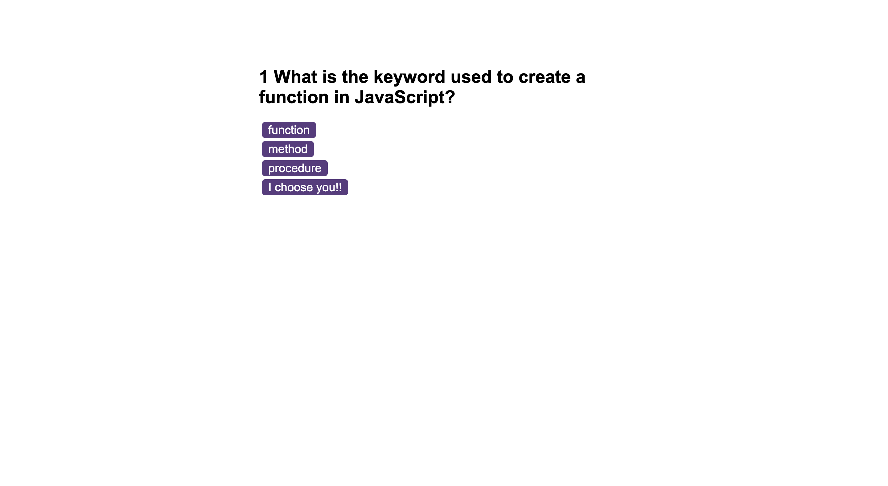

# code-quiz
JS Code Quiz

## description
Coding quiz using javascript CSS and HTML. The quiz has a start page and highscores. A timer is used to track th users time and time is deducted or added dependant on answers.

## screenshot

## link
https://markmos1991.github.io/code-quiz/